<p align="center"></p>
<h1 align="center">RPL PRIMA Web Application</h1>
<br></br>


<h1>Overview</h1>
Welcome to the GitHub repository for the RPL PRIMA web application. This project is a comprehensive web solution for RPL PRIMA, a company specializing in providing offline driving training services. Our application offers an intuitive interface for customers to explore the company's services and register for driving classes, and a robust backend for admins and owners to manage company data and activities.


### This web application was created by K01_G14. Meet our beloved members!

```
1. Benyamin Jodi Sitinjak - 18221147
2. Nadira R A- 18221059
3. Timothy Subekti - 18221063
4. Nadine Aliya Putri - 18221081
5. Carissa Zahrani Putri - 18221093
```

<br></br>

## Features

### For Customers

- **Company Profile** and Services Overview: A detailed landing page showcasing RPL PRIMA's services, including various driving class packages.
- **Student Registration:** A user-friendly form allowing prospective students to register and enroll in driving classes.

### For Admin and Owner

- **Data Management:** Both admins and owners have access to tools for managing company data.
- **Secure Login:** Admin accounts are created by the owner, ensuring a secure management system.
- **Change Password:** Provide flexibility for both admins and owners to change their password
- **Remember Me:** Both admin and owner accounts have access to a "Remember Me" option for easier and faster subsequent logins.

<br></br>

## Tech Stack

**Framework:** NEXT.JS, TailwindCSS

**ORM:** Prisma

**Database:** Supabase

**Testing:** Jest, Postman

<br></br>

<h1>Getting Started</h1>

## Prerequisites

Before you begin, ensure you have met the following requirements:

- **Node.js**: This project requires Node.js version 20.0.0 or higher. To check your Node.js version, run `node -v` in your terminal. If you need to update or install Node.js, visit [Node.js Download](https://nodejs.org/en/download/).
- **Cloud Database Access**: Ensure you have access to a cloud database. This project uses Supabase as the cloud database. Set up an account or log in to your existing Supabase account to connect the application to the database.

<br></br>

## Installation

These instructions will get your copy of the project up and running on your local machine for development and testing purposes.

First of all you need to clone this project or **donwload the file**

```bash
  git clone https://github.com/TimothySubekti0322/Init-RPL-K01-G14
```

Go to the project directory

```bash
  cd Path/to/Init-RPL-K01-G14
```

Then install all the dependencies by simply run this code on the terminal

```bash
  npm install
```

Next, Create a .env file that contains your Database URL connection and your personal JWT SECRET. Copy this code below, paste it on your .env file, change **YOUR_DATABASE_CONNECTION_URL** with your own database url connection and **YOUR_JWT_SECRET_KEY_HERE** with your JWT Secret for encryption

```bash
DATABASE_URL=YOUR_DATABASE_CONNECTION_URL
JWT_SECRET=YOUR_JWT_SECRET
NODE_ENV="development"
```

Next, in Schema.prisma , you could change db provider to anything you want. but it would be recomended if you are using postgresql

Then, Run migration to create database in your local database that using this command bellow

```bash
npx prisma migrate dev
```

Then run this command below to filled initial data in your database

```bash
npx prisma db seed
```

then to run the website locally , you need to run this command below

```bash
  npm run start
```

Now you can access the server in http://localhost:3000/

<br></br>

## Route

**customer** : http://localhost:3000/

**Owner/Admin** : http://localhost:3000/auth/signin

## Notes

Owner Account

**email :** owner@gmail.com

**password :** owner

<br></br>

<h1>Use Cases</h1>

The RPL Prima web application implements the following use cases:
1. **View Class Packages** PIC: Nadira (18221059)
  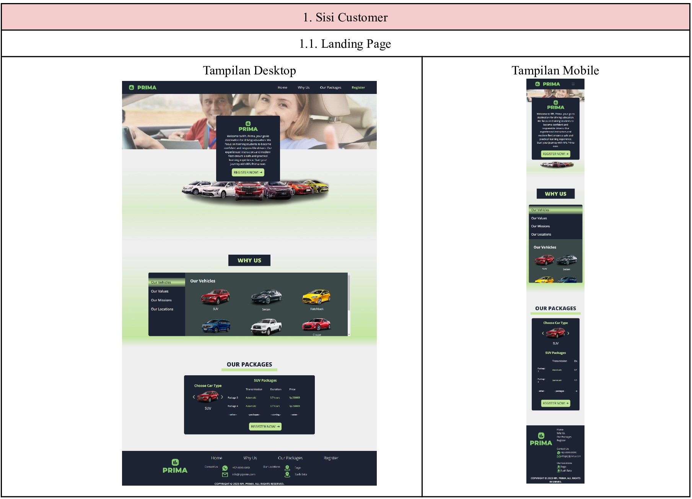

2. **Register as Student** PIC: Nadira (18221059)
  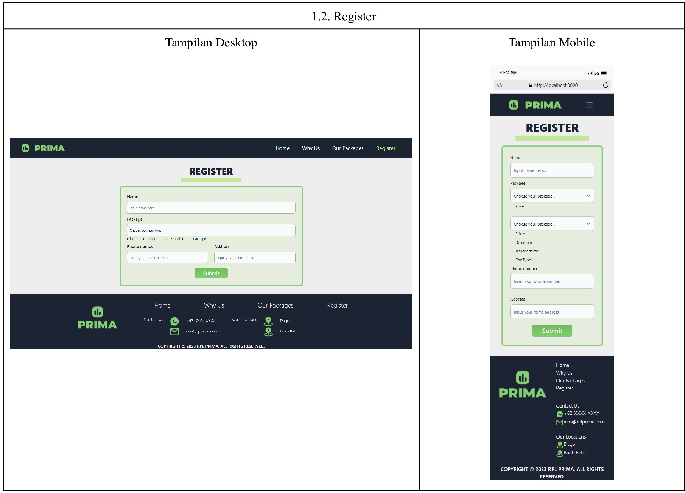

3. **Log In** PIC: Timothy (18221063)
  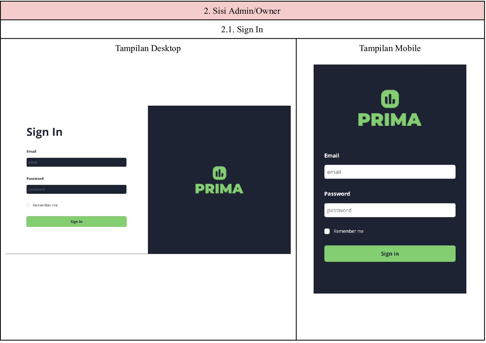

4. **View Dashboard** PIC: Timothy (18221063)
  
   
5. **Manage Classes** PIC: Carissa (18221093)
    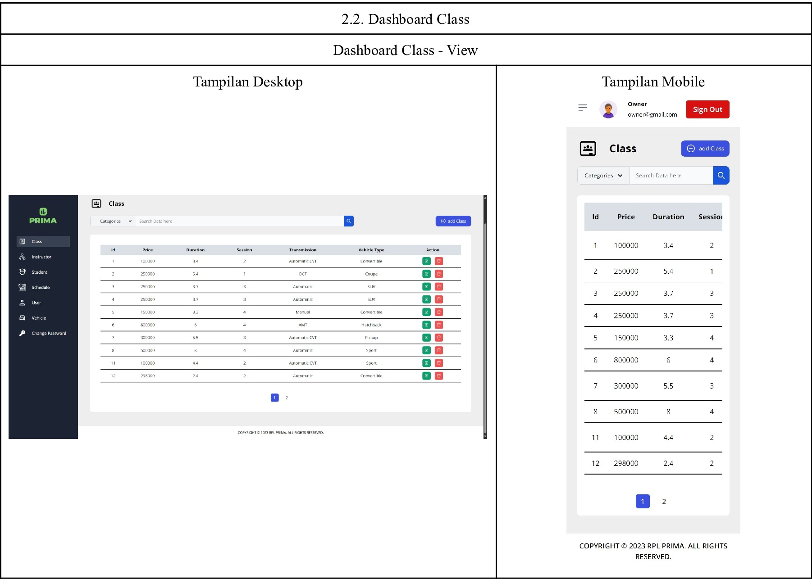
    
    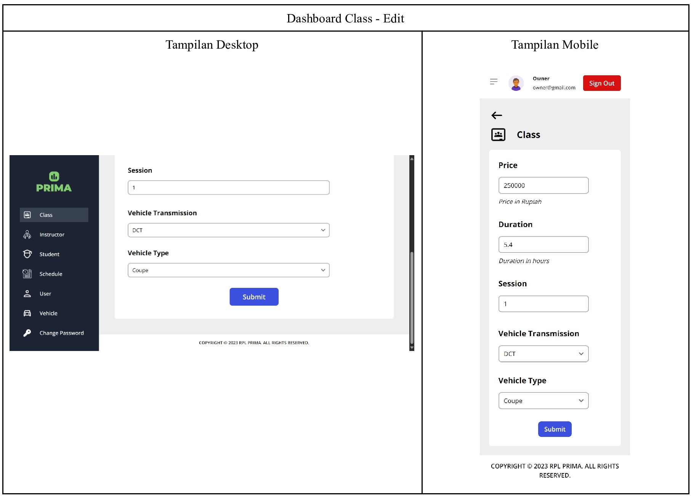
    
   
6. **Manage Instructors** PIC: Carissa (18221093)
    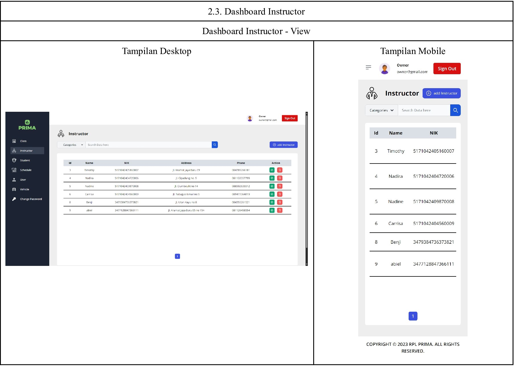
    
    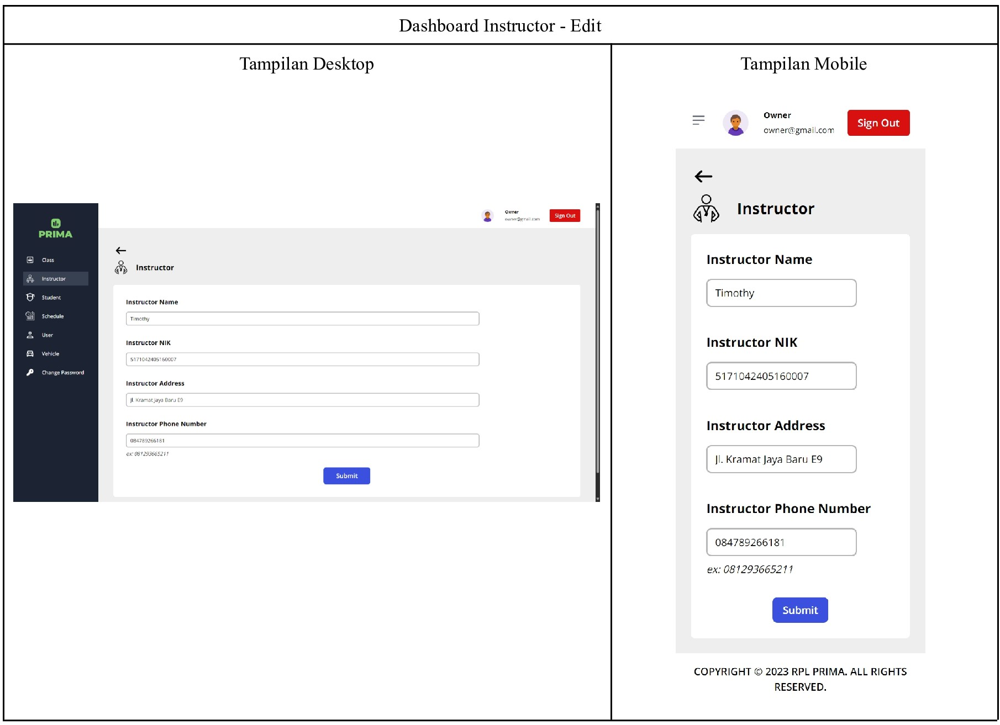
    
    
7. **Manage Students** PIC: Nadine (18221081)
    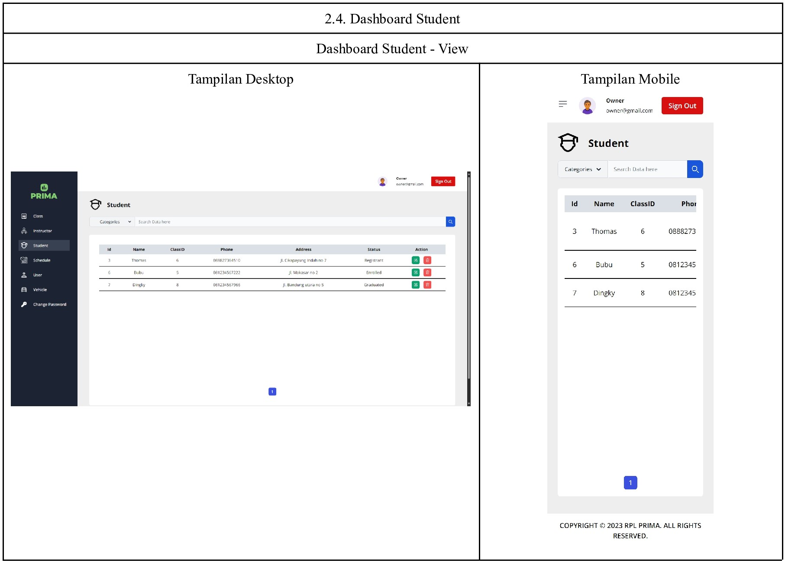
    
    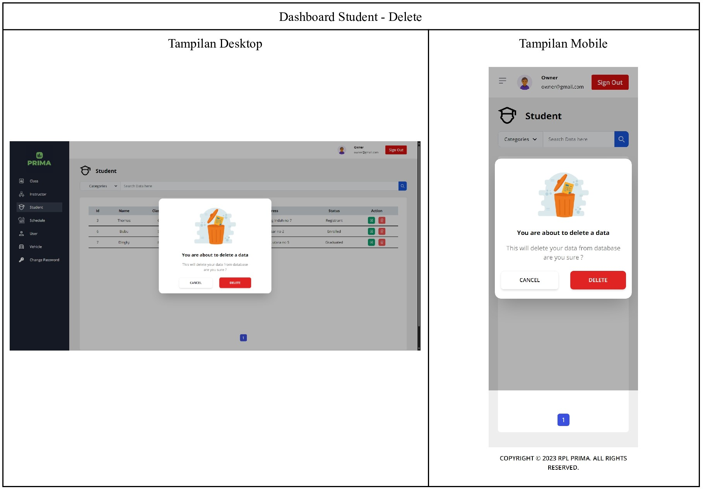

5. **Manage Users** PIC: Nadine (18221081)
   
   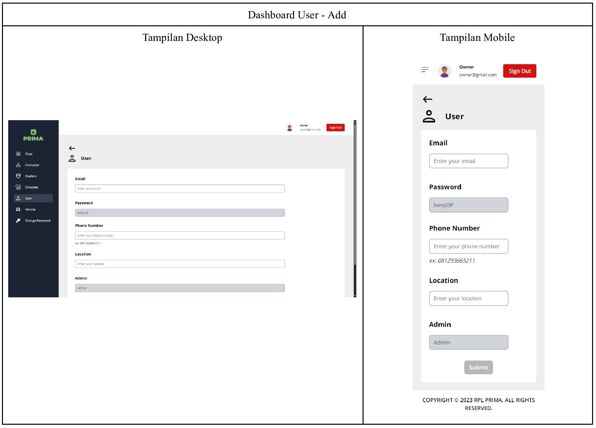
   
   

9. *Manage Vehicles* PIC: Jodi (18221147)
Tampilan layar fungsional ini sama seperti fungsional Manage Vehicle Status

10. *Manage Vehicle Status* PIC: Jodi (18221147)
    
    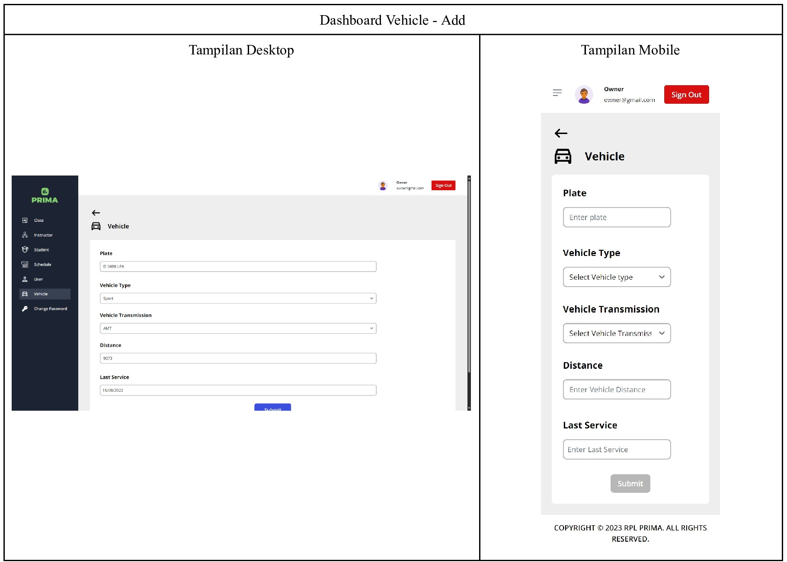
    
    
    
10. **Manage Vehicle Status** PIC: Jodi (18221147)
    Tampilan sama dengan use case "manage vehicle" hanya dengan perbedaan authorization untuk edit bagi owner dan admin.  

## Additional Screens
1. **Change Password** PIC: Timothy (18221063)
    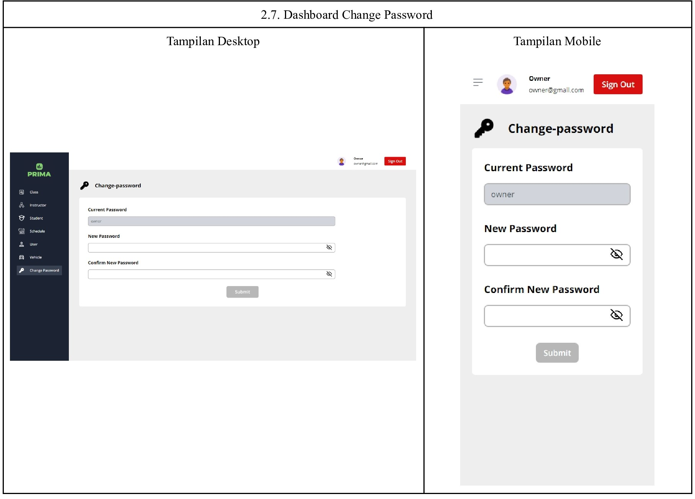

2. **Manage Errors** PIC: Nadira (18221059)
    
    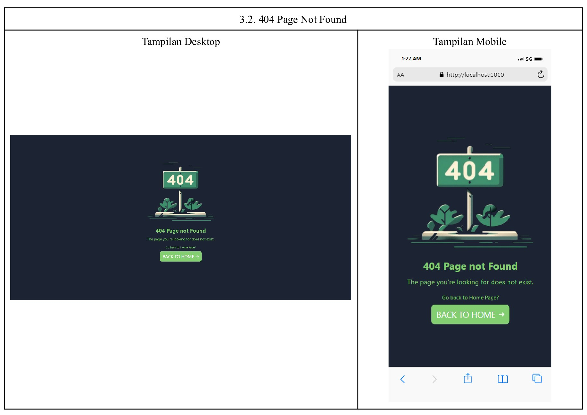

<br></br>

<h1>Database</h1>

Here are the details of the database used in the RPL Prima web application.
1. Class - manages the different types of classes offered by RPL Prima. The Class
```
   - id: int
   - price: int
   - duration: float
   - session: int
   - transmission: string
   - vehicle type: string
   - student: Student[] 
```
2. Instructor - manages the details of the different instructors registered in RPL Prima.
```
   - id: int
   - name: string
   - nik: string
   - address: string
   - phone: string
```
3. Student - Student manages all the registrants, current students, and past students that have passed the driving course.
```
   - id: number
   - name: string
   - class: Class
   - classId: int
   - phone: string
   - address: string
   - status: string
```
4. User - manages the accounts for the admins and owners of RPL Prima.
```
   - id: int
   - email: string
   - password: string
   - phone: string
   - location: string
   - role: string
```
5. Vehicle - manages the details of each vehicle and its status of availability.
```
    - id: int
    - plate: string
    - vehicleType: string
    - transmission: string
    - lastService: date
    - distance: int
    - status: string
```
